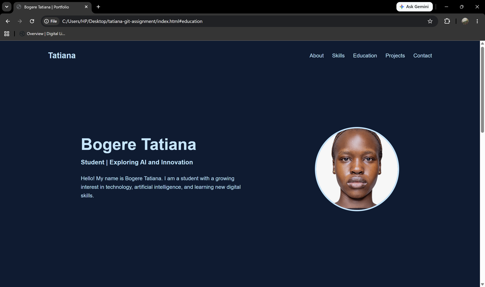
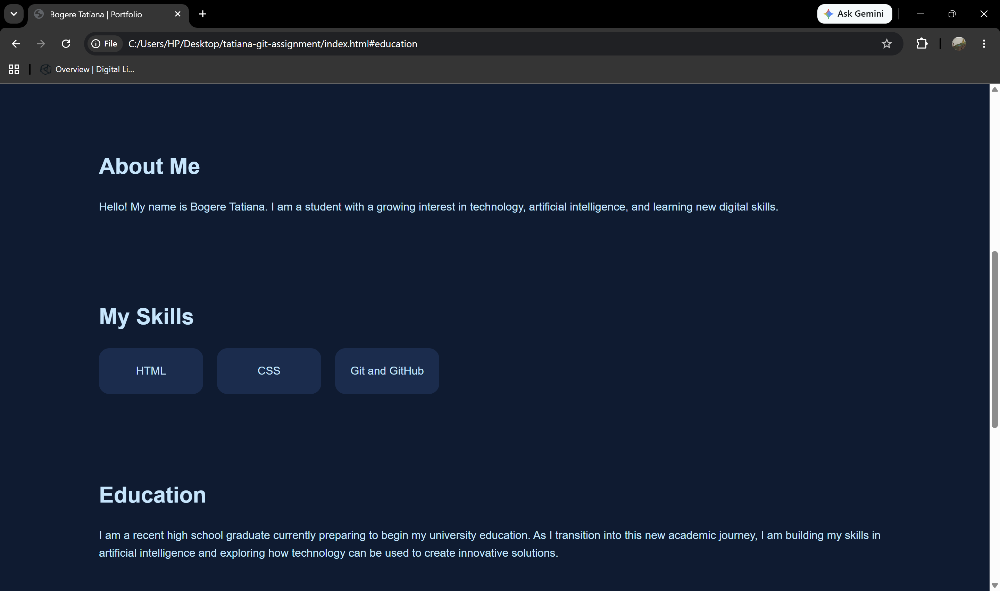
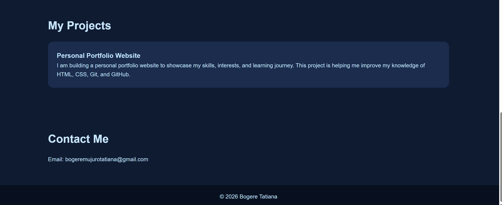

# Bogere Tatiana - Portfolio Website

## Project Description
This is my personal portfolio website created as part of my Git and GitHub assignment. The website introduces me, showcases my skills, education background, projects, and contact information.

## Technologies Used
- HTML
- CSS
- Git
- GitHub

## How to Open the Project
1. Clone or download this repository.
2. Open the project folder in Visual Studio Code.
3. Open the index.html file using a web browser.

## Features Included
- Personal introduction section
- Skills section
- Education section
- Project section
- Contact information section
- Profile image
- Styled webpage design

## Screenshot

## Website Preview

### Header Section

### Skills Section

### Contact Section

## What I Learned About Git and GitHub
Through this project, I learned how to use Git for version control, create commits, create branches, merge changes, and publish projects on GitHub. I also learned how GitHub helps developers store and collaborate on projects.

